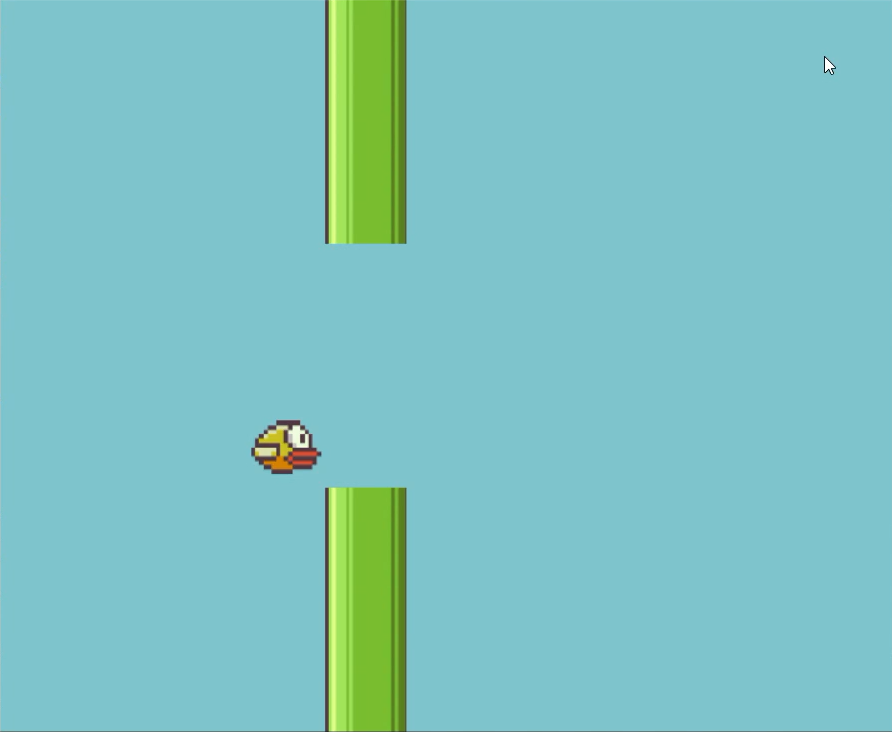

<<<<<<< HEAD
# flappy-gpt
GPT as Game Engine to Run Flappy Bird
=======
# 🦜 Flappy Bird GPT Game Engine

A demo of using GPT-4/ChatGPT as a game engine for running Flappy Bird. It encodes the state of the game using '0' for empty spaces, '|' for pipes and '>' for the bird.

## Instructions
1. Install required libraries:
`pip install -r requirements.txt`
2. Make a `.env` file with the below format and use your own OpenAI API KEY:
`OPENAI_API_KEY=[YOUR-OWN-KEY]`
3. Run the `main.py` file.

## Improvements

The games doesn't really work, at least in a logical manner. Here are some possible improvements:
- Prompt Engineering: GPT has a hard time generating states of the game that are presistant with the previous state and also follow the rules of the game. 
- Screen for Dead: If the bird dies, the program exists with an error. Proper error handling along with a good screen visualization is needed.
>>>>>>> 94e5c9e7d91dab4f068029cad32ce9e169888824
